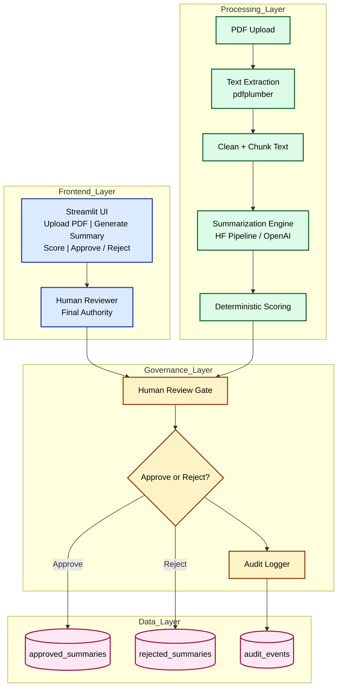

# Human-in-the-Loop Financial Document Summarizer

   

A governed AI workflow that summarizes financial PDFs using LLMs while enforcing:

* deterministic scoring
* human approval
* audit logging
* safe persistence

Designed for regulated environments where AI assists decisions but never replaces human authority.

> **LLMs propose. Deterministic systems evaluate. Humans decide.**

---

## Architecture


### Mermaid Architecture Source



---

## Tech Stack

* Python
* Streamlit
* OpenAI GPT-4o / HF pipeline
* pdfplumber
* PostgreSQL / Supabase
* Deterministic scoring engine
* Audit logging layer

---


---

## Quick Start

```bash
git clone https://github.com/yourname/project.git
cd project

python -m venv venv
source venv/bin/activate  # Windows: venv\Scripts\activate

pip install -r requirements.txt
streamlit run streamlit_app.py
```

---

## Folder Structure (Matches Your Repo)

```
project/
├── README.md
├── requirements.txt
├── schema.sql
├── main.py
├── streamlit_app.py
├── score_logic.py
├── db_smoke.py
├── keep_supabase_alive.py
└── assets/
    ├── architecture.svg
    └── screenshot1.png
```

---

## Impact

This project demonstrates production-safe AI patterns:

✅ human authority over AI
✅ deterministic validation over probabilistic trust
✅ audit-ready architecture
✅ enterprise AI governance
✅ regulated-domain workflow design

This is not a chatbot demo.
This is a governed AI system.

---

## License

MIT

---


```
assets/screenshot1.png


```

3. README already references it:

```md

```


