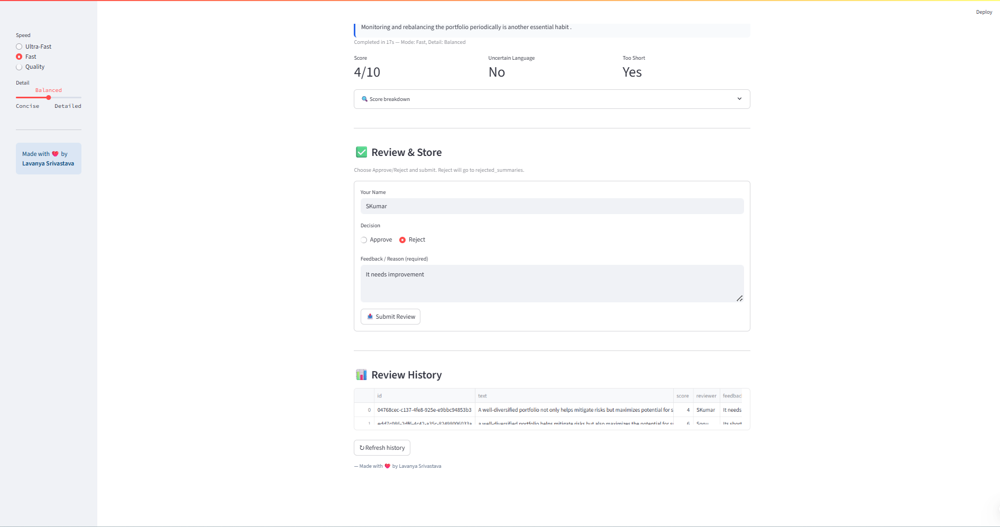

---

```md
# 🧠 Human-in-the-Loop Document Summarizer


An AI-powered document summarization system with human validation in the loop.  
The system extracts PDF text, generates summaries, scores quality, and requires human approval before storing results.

Designed for safe, accountable, real-world AI workflows.

---

## 🚀 Features

- 📄 PDF text extraction
- 🤖 LLM-powered summarization
- 📊 Quality scoring (coverage, clarity, language)
- 👩‍⚖️ Human approval system
- 🗄 PostgreSQL storage
- 🔐 Secure environment config
- 🌐 Streamlit interface
- ☁️ Cloud-ready architecture

---

## 🏗 Architecture



**Pipeline**

PDF → Extraction → AI Summary → Scoring → Human Review → Database

Human oversight ensures reliable AI output.

---

## 📸 Screenshots

| Interface | Review Panel |
|----------|-------------|
|  |  |

---

## 📂 Project Structure

```

HumanInTheLoopDocSummarizer/
├── app/
│   ├── db.py
│   ├── migrations.py
│   └── roles.py
├── assets/
│   ├── architecture.svg
│   ├── screenshot1.png
│   └── screenshot2.png
├── db_smoke.py
├── keep_supabase_alive.py
├── main.py
├── streamlit_app.py
├── score_logic.py
├── schema.sql
├── requirements.txt
├── README.md
├── .env
├── .gitignore
└── snapshots/

````

---

## ⚙️ Installation

Clone repo:

```bash
git clone https://github.com/YOUR_USERNAME/HumanInTheLoopDocSummarizer.git
cd HumanInTheLoopDocSummarizer
````

Create environment:

```bash
python -m venv venv
venv\Scripts\activate
```

Install dependencies:

```bash
pip install -r requirements.txt
```

Create `.env` file:

```env
OPENAI_API_KEY=your_key
DB_URL=your_database_url
```

Run app:

```bash
streamlit run streamlit_app.py
```

---

## 🧪 Use Cases

* Financial document review
* Healthcare compliance summaries
* Legal analysis pipelines
* Enterprise AI governance
* Human-supervised automation

---

## 🔐 Human-in-the-Loop Safety

This project prevents blind AI automation.

All AI summaries must be approved by a human before storage.

✔ Reduces hallucination
✔ Adds accountability
✔ Ensures compliance
✔ Builds AI trust

---

## 📌 Future Improvements

* Batch document processing
* Reviewer dashboard
* Audit logging
* Explainability layer
* Model comparison system

---

## 👩‍💻 Author

Lavanya Srivastava
AI Developer • Trainer • Human-centered AI Advocate

---

## 📄 License

MIT License

```

---


Best regards,
```
